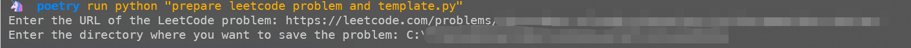
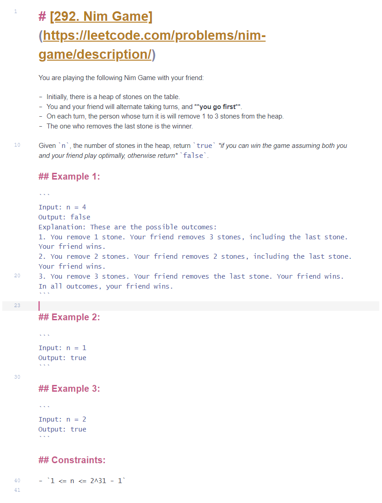
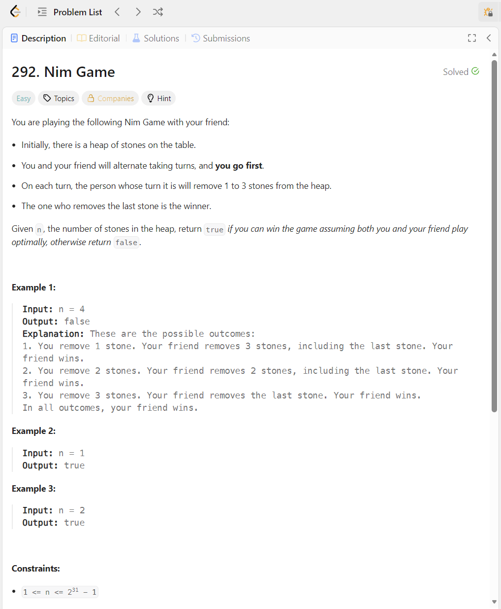

# Prepare LeetCode Problem and Template

Create a local workspace for a LeetCode problem from its URL.

The script fetches the problem title, description, and C++ starter code, then generates a problem folder with a formatted `README.md` and solution template.



 <-------- 

1. Install `uv` from [the official installation guide](https://docs.astral.sh/uv/getting-started/installation/)

2. Install the project dependencies with `uv`:

    ```
    uv sync
    ```

3. Run the project by executing the cmd script or typing the following command:
    ```
    uv run "prepare leetcode problem and template.py"
    ```
