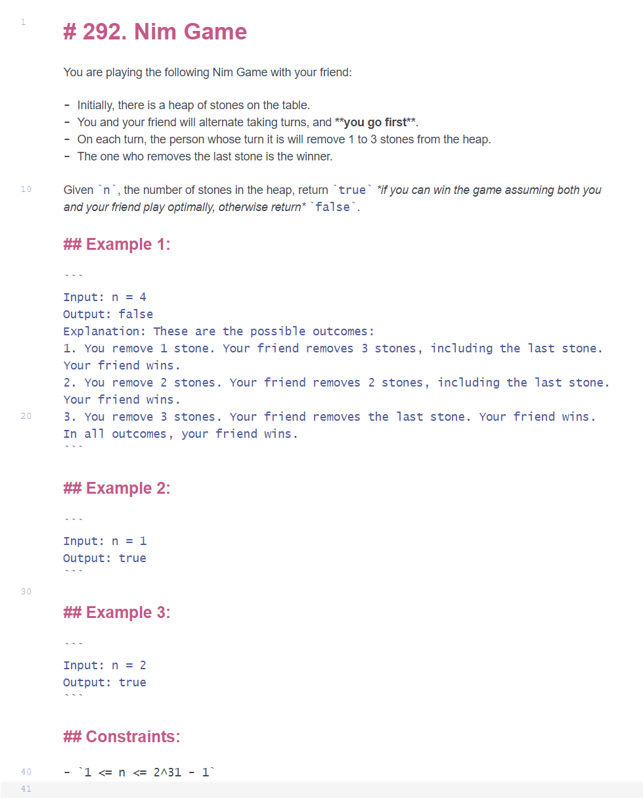

     <---   

1. Install poetry from [the official website](https://python-poetry.org/docs/#installation)

2. (Optional) Configure poetry to create virtual environments directly in the project directory:

    ```
    poetry config virtualenvs.in-project true
    ```

3. Install the project dependencies:

    ```
    poetry install --no-root
    ```

4. Run the project by executing the cmd script or typing the following command:
    ```
    poetry run "prepare leetcode problem and template.py"`
    ```
